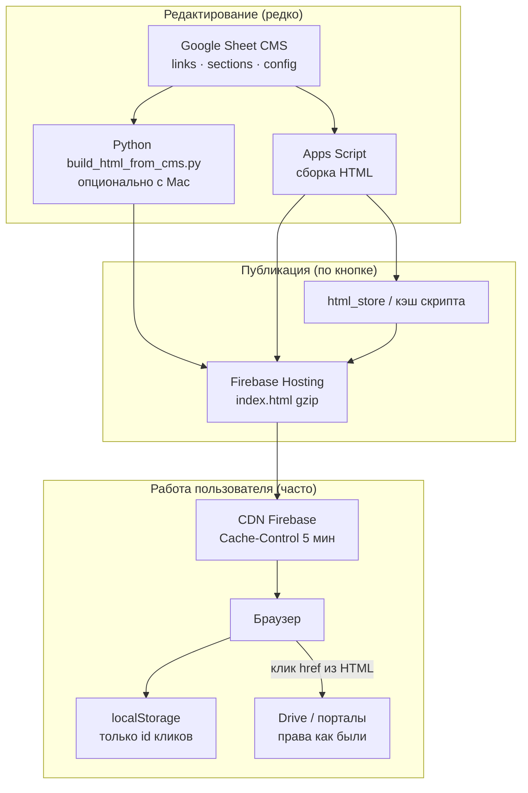
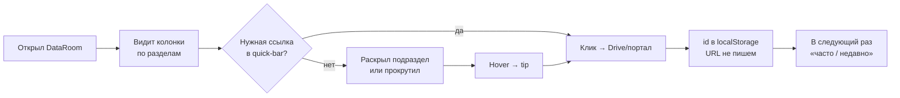
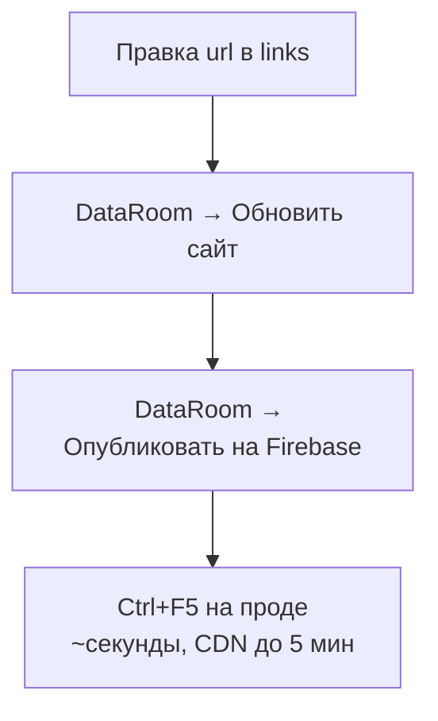

# DataRoom — навигатор по корпоративным ссылкам

Короче: **таблица как CMS → статический сайт → Firebase Hosting бесплатно**.  
Пользователь кликает — сервер молчит. Правки в таблице — два пункта меню, и прод обновлён.

Задача была простая: сотня папок Drive, порталы, отчёты — люди теряются в закладках. Нужен один экран, который **редактирует не разработчик, а тот, кто ведёт ссылки**, и который **не падает**, когда зашли 200 человек одновременно.

---

## Что сделано

- **CMS на Google Sheets** — листы `links`, `sections`, `config`; без отдельной админки.
- **Генератор HTML** — Apps Script в таблице или Python-скрипт с Mac.
- **Статика на Firebase Hosting** — один `index.html`, CDN, $0 на типичных нагрузках.
- **Клиентский JS** — «часто у вас» и «недавно» через `localStorage`, только id, без запросов на сервер.
- **Деплой из меню таблицы** — «Обновить сайт» → «Опубликовать на Firebase»; SA-ключ лежит на Drive, не в коде.

Никаких своих серверов, баз, Docker. Таблица уже есть у компании — используем её.

---

## Фишки и удобство

| Фишка | Зачем |
|-------|-------|
| Колонки 2–6 из листа `sections` | Верстка под структуру компании, не хардкод |
| `<details>` по подразделам | Длинные списки не давят на экран |
| `desc` + `tip` на hover | Подсказки без модалок и без JS на сервере |
| `highlight` / `featured` | Важные ссылки видно сразу |
| `active=FALSE` | Выключить ссылку, не удаляя строку |
| Quick-bar «часто / недавно» | Персонально в браузере, общий HTML один на всех |
| `url=#` | Черновик в таблице — на сайте заглушка, не битая ссылка |

**Плюсы по деньгам и нагрузке:** при 200 пользователях — 200 отдач gzip-статики с CDN, не 200× Apps Script. Google Sheets API дергается **только при публикации**, не при каждом клике. Firebase Spark покрывает такой сценарий.

---

## Схема хранения (почему это эффективно)



**Идея:** тяжёлое — один раз при публикации; на пользователя — кэш и локальная история.

---

## Процесс пользователя



**Редактор контента** (не пользователь сайта):



---

## Стек

| Слой | Технология |
|------|------------|
| CMS | Google Sheets |
| Сборка | Apps Script / Python 3 |
| Хостинг | Firebase Hosting (Spark) |
| Фронт | HTML + CSS + vanilla JS |
| Авторизация файлов | Google Drive (как было) |

---

## Структура репозитория

```
apps-script/Code.gs           — меню, сборка HTML из листов
apps-script/FirebaseHosting.gs  — деплой через Hosting API + SA
build_html_from_cms.py        — та же сборка без Web App
publish-from-google.sh        — CMS → Firebase с Mac
dataroom.css / dataroom-client.js
docs/DATA-SCHEMA.md             — схема листов
docs/DESIGN-EDGE-CASES.md       — запас прочности
```

---

## Быстрый старт (обезличенно)

1. Создайте таблицу с листами по `docs/DATA-SCHEMA.md`.
2. **Расширения → Apps Script** — вставьте `apps-script/Code.gs` и `FirebaseHosting.gs`, `appsscript.json`.
3. Firebase: проект Spark, Hosting, service account → ключ в Drive, `firebase_sa_file_id` в `config`.
4. Меню **DataRoom → Обновить → Опубликовать**.

С Mac (без меню):

```bash
export DATAROOM_SPREADSHEET_ID="YOUR_SPREADSHEET_ID"
export DATAROOM_SHEETS_TOKEN="..."   # или oauth-config.json
cp .firebaserc.example .firebaserc   # подставить project id
# положить .firebase-sa-key.json
bash publish-from-google.sh
```

---

## Безопасность localStorage

Храним **только id** (`link-12`, `portal-main`). URL всегда из HTML страницы — если ссылку убрали из CMS, старый id просто не найдётся. Подменить href через DevTools пользователь может и так; доступ к файлам всё равно на стороне Drive.

---

## Лицензия

MIT — используйте как шаблон под свой портал ссылок.
